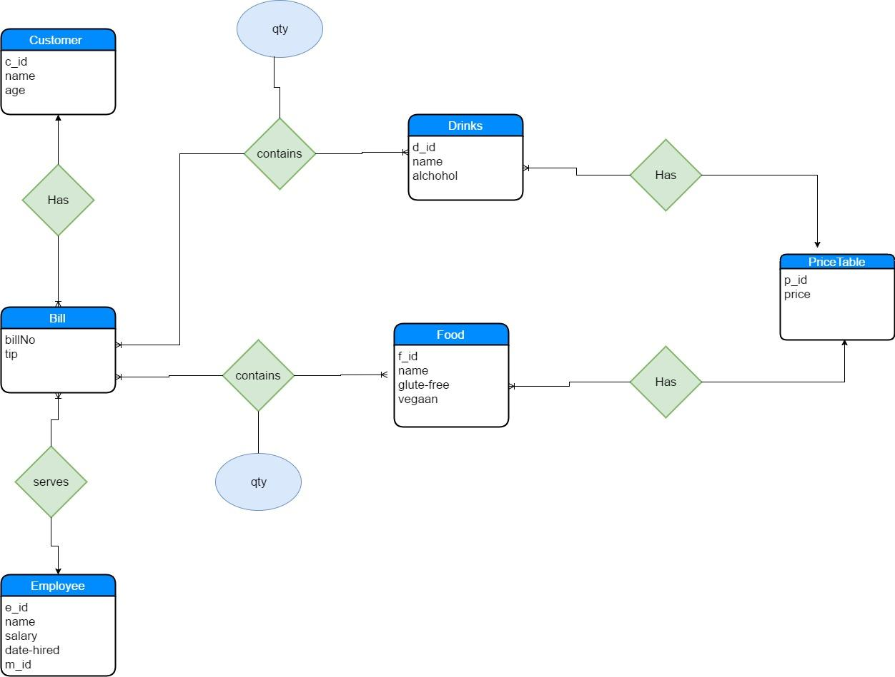
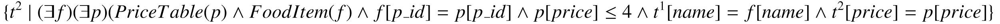
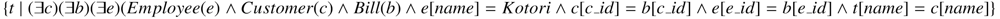
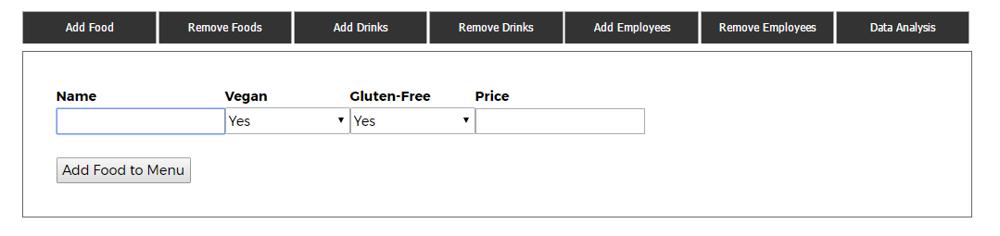
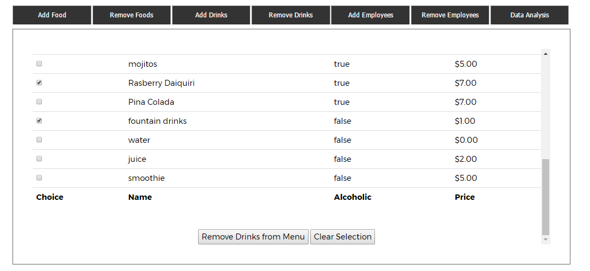
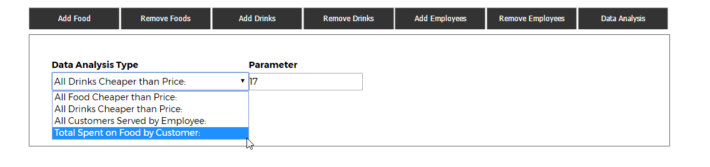
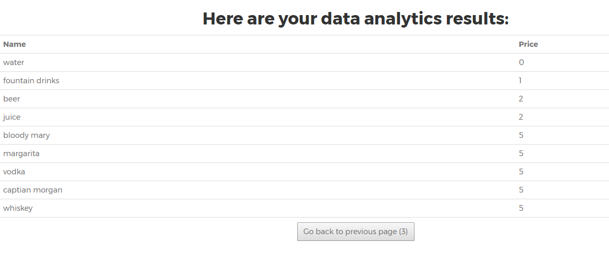

*Mos Eisley Cantina*

1. Introduction

This web-based management-oriented application is an application for a bar. It keep track of the foods and drinks available to serve, which employee served which customer, and how much food/drink is ordered on each bill. Customer can view the food available, and when ordered an item, the related personnel will record the data with this application. Manager can also modify food item and drink item in this application and view the food and drink purchases from the past.

2. Application Requirements Specification - Dominique Owens

Our application will display our menu for both drinks and beverages. It can be used by both customers and the bars administrative staff to perform several tasks.  Customers will be able to view all the items on the menu and make selections on items to put on their bill. After making these selections they will be prompted to tell their order to whoever is working at the bar. The customer will also be able to get other information from the application, such as the bars founders and food critic reviews. 

This application will also allow administrators to make changes to the bar’s menu and staff. For example, administrative personnel can add and remove food or drink items, and these changes will appear immediately on our application. This feature can be very helpful when changing the prices of menu items, and also for quickly changing to menu for temporary promotional menu items. 

Administrative personnel can also add and remove employees on this application. This feature will make the integration process for new employees a lot easier. Finally, administrative personnel can perform range and performance queries on this application. They could find all the food or drink items that are less than a certain price, or they can see all the customers that have been served by a certain employee.  

3. Database Requirements Specification - Dina Benayad-Cherif

Our database for Mos Eisley Cantina keeps track of all items on the menu, including drinks and food, customers who have come into the bar and employees. 

<table>
  <tr>
    <td>Objects</td>
    <td>Details</td>
  </tr>
  <tr>
    <td>Customer</td>
    <td>Customer_ID
Name
Age</td>
  </tr>
  <tr>
    <td>Employee</td>
    <td>Employee_ID
Name
Salary</td>
  </tr>
  <tr>
    <td>Bill</td>
    <td>BillNo.
Customer_On_Bill
Employee_Serving_Customer
Tip</td>
  </tr>
  <tr>
    <td>FoodItem</td>
    <td>Food_ID
Food_Name
Price</td>
  </tr>
  <tr>
    <td>DrinkItem</td>
    <td>Drink_ID
Drink_Name
Alcoholic
Price</td>
  </tr>
  <tr>
    <td>Purchase</td>
    <td>BillNo.
Item
Quantity</td>
  </tr>
</table>

Above is a rough outline of what we wanted to keep track of in our database. It should keep track of transactions that have happened at the bar and be able to query important data from these transactions, including total revenue made for a certain date, average tip of a customer and restaurant inventory.  These queries would be quite frequent because the information is critical to the success of Mos Eisley Cantina, or any restaurant for that matter. The database would be manipulated in real-time when restaurants are serving customers and as orders are being placed. 

4. ER Data Model Design - Dominique Owens

5. Transforming the ER Model to the Relational Model - Dina BC

Customer(c_id, name, age)

* C_id is the primary key.

Employee(e_id, name, salary, date-hired, m_id)

* E_id is the primary key.

Food(f_id, name, p_id, gluten-free, vegan)

* F_id is the primary key.

* P_id is a foreign key referencing p_id in PriceTable.

Drinks(d_id, name, p_id, alcoholic)

* D_id is the primary key.

* P_id is a foreign key referencing p_id in PriceTable.

PriceTable(p_id, price)

* P_id is a primary key.

FoodPurchase(billNo, f_id, qty)

* billNo is a primary key and foreign key referencing billNo in Bill

* F_id is a primary key and foreign key referencing f_id in Food

DrinkPurchase(billNo, d_id, qty)

* billNo is a primary key and foreign key referencing billNo in Bill

* D_id is a primary key and foreign key referencing d_id in Drink

Bill(billNo, c_id, e_id, tip)

* billNo is a primary key.

* C_id is a foreign key referencing c_id in Customer.

* E_id is a foreign key referencing e_id in Employee.

The entity integrity constraints are that all primary keys in our database are not null and unique, meaning that no two rows in a table have the same primary key. The system enforces this by rejecting any insertion into a table with a primary key that already exists in that table. The referential integrity constraints maintain foreign keys. Every foreign key in each table references an existing primary key in another table. If, for instance, we want to delete a food or drink from our menu and since other tables reference their primary ids, it deletes all other children referencing f_id or d_id by the cascade effect. 

6. SQL Queries and Exercise in RA and TC - Dominique Owens 

    1.  What is the total price of drinks on Person A’s bill?

SELECT B.billNum, sum(P.price* DP.qty) 

FROM Bill B, Drinks D, DrinkPurchase DP, Customer C, PriceTable P 

WHERE B.billNum = DP.billNum AND A = C.name AND 

C.c_id = B.c_id AND D.d_id = DP.d_id AND 

D.p_id = P.p_id AND GROUP BY B.billNum

    2.  Get all food items that have price 4 or less.

SELECT F.name, P.price 

FROM FoodItem F, PriceTable P 

WHERE P.p_id = F.p_id AND P.price ≤ 4 

    3.  Get all the customers that employee Kotori served.

SELECT C.name 

FROM Customer C, Bill B, Employee E 

WHERE E.name = "Kotori” AND B.c_id = C.c_id AND E.e_id = B.e_id

    4.  Get all the customers who have served all the drinks this bar provides.

SELECT E.name 

FROM Employee E 

WHERE NOT EXIST (( SELECT D1.d_id 

FROM Drinks D1 )

EXCEPT

( SELECT D2.d_id 

FROM Bill B, Drinks D2, DrinkPurchase DP 

WHERE B.e_id = E.e_id AND D2.d_id AND DP.d_id 

AND B.billNum = DP.billNum))

      

    5. Get the average tip that a customer gives.

SELECT C.name, avg(B.tip) 

FROM Customer C, Bill B 

WHERE B.c_id = C.c_id 

GROUP BY C.name

7. Integrity Constraints -  Dina Benayad-Cherif

Regarding domain integrity constraints, all of our primary keys were stored as integers in our database. Any name attributes of the tables are stored as character strings. For drinks and food, we keep track of specific characteristics, like if it is alcoholic, gluten-free or vegan, as boolean values. The only unique values in our database are the primary keys for each table, any other attribute does not necessarily have to be unique. All foreign keys referenced from another table are also primary keys of that table. 

There can only be one customer and one employee on each bill. 

8. Relational Database Design - Lee Kelvin

	Bill(billNum,c_id,e_id,tip)  

FD(billNum -> billNum,c_id,e_id,tip)

	Drinks(d_id,dname,p_id,alcohol) 

FD(d_id -> d_id, dname, p_id,alcohol)

 Customer(c_id, cname,age) 

FD(c_id -> c_id, cname,age)

DrinkPurchase(billNum,d_id,qty) 

FD(billNum, d_id -> billNum, d_id, qty)

Employee(e_id,ename,salary, datehired) 

FD(e_id,e_id,ename,salary,datehired)

FoodItem(f_id, fname, p_id,vegan,glutenfree) 

FD(f_id -> f_id,fname, p_id,vegan,glutenfree)

FoodPurchase(billNum,f_id,qty)  

FD( billNum, f_id -> billNum, f_id, qty)

PriceTable(p_id,price) 

FD(p_id -> p_id, price)

This database is BCNF because all entity has only one nontrivial FD, and the left-hand side attribute is a key. 

9. Revisiting the Relational Database Schema - Lee Kelvin

	There was a change on food/drink purchase. Originally, these two has primary key that contains c_id, f_id/d_id. The problem with that is if someone orders the same thing twice, there will be duplicate primary key value. In order to avoid  that, the first solution is to add date in the primary key, but it is decided that to add date is too complicated, so the final decision is to replace c_id with billNum. Each bill will be a different billNum, so even if someone orders same thing twice, the primary key’s value will be unique, and the person who ordered it will be tracked from bill.

10. DBMS Implementation - Dina Benayad-Cherif

Our database was implemented in MySQL. We ran into some issues where we have a lot of foreign keys being referenced by several tables and tables must be created before applying any foreign keys that may reference that specific table. To resolve this issue, we created all eight tables without any foreign key constraints and then altered the tables to apply the constraints afterwards. We also did redesign our database to condense the m_id (manager id) to be contained within the Employee entity rather than having an additional entity, Manager. 

11. Server Implementation - Daniel Grigsby

    6. The server was implemented using Java Server Pages, hosted on a remote computer inside Case with Apache Tomcat Server. We used JDBC to communicate between our Java Server Pages and our MySQL server.  Details on the code are in Appendix 3. 

12. Website Design - Daniel Grigsby

    7. Inspired by many restaurant webpages, extensively used Bootstrap and jQuery to manipulate elements. 

    8. Full list of open source libraries credited in README.MD

    9. User Interface Screenshots:
**Insertions:**	
**Deletions**

**Common Data Analytics
****
Query Results
**

13. Team Roles - Daniel 

    10. Dominique

        1. ER Model Design

        2. SQL/RA/TRC query design

    11. Dina

        3. DBMS Implementation

        4. ER to	 Relational conversion

    12. Lee

        5. Database normalization

        6. Data creation & entry 

    13. Daniel

        7. Website design/implementation

        8. Server hosting

14. Conclusion - Daniel

    14. We have created a quality full stack application for users to view the menu of an restaurant, and for managers of the restaurant to manage items sold on the menu, and employee or food listings on the menu. 

    15. We learned how to integrate databases with a website, and the basics of web design. We gained experience designing a database, analyzing it through normalization techniques and implementing it. 

    16. We gained valuable experience working in a group, using version control and organizing a team with GitHub. Analyzing team member’s strengths and distributing work accordingly was a large part of the process. 

15. Appendix 1: Installation Manual - Daniel

    17. Database Setup

        9. Install MySQL Workbench 6.3 CE

        10. Create a new database connection on localhost with port 3306

        11. Set up a login to this database with user "root" and password “UnforgettablePassword” (configurable, but this is easier than changing all the code (we should probably centralize that…)

        12. Create a Schema called ‘bar’ in MySQL, set it as your default Schema. Use Server -> Data Import command in MySQL Workbench to import the "MySqlDump.sql" file under the SQLDataDump folder

    18. Server Setup

        13. Install Java, versions 5,6,7 or 8 from Oracle, and set your ‘JAVA_HOME’ environment variable to your jdk/jre directory. 

        14. Install Apache Tomcat  6 version 6.0 from [https://tomcat.apache.org/download-60.cgi](https://tomcat.apache.org/download-60.cgi) , we used Windows, so the instructions assume you use that version and use the ‘Install as Windows Service" option.  Upon first run, there is likely a tutorial that sets up the default configuration, complete it.

        15. Navigate to your Apache Tomcat install folder, likely "C:\Program Files\Apache Software Foundation\Tomcat 6.0", and open the webapps\root folder. Delete everything in it, and paste the contents of the webapps folder in our repository there

    19. Execution / Publishing

        16. Start the Apache Tomcat Monitor process, from start menu.

        17. Right click the Apache Tomcat tray icon and Stop, then restart the service

        18. Navigate to 127.0.0.1:8080 in your browser to view the website

        19. To make the website visible to other users on your LAN, open port 8080 in your firewall. 

16. Appendix 2: User’s Manual - Daniel

    20. Assuming the server is setup (see Appendix 1), go to the URL [http://127.0.0.1:8080](http://127.0.0.1:8080) in your browser, and scroll to the bottom of the page to insert/remove data and perform analytics queries. Please ensure JavaScript is not disabled in your browser.

17. Appendix 3: Programmer’s Manual - Daniel

    21. SQLDataDump contains our create schema/insert data files to be imported with MySQL or another DBMS.

    22. InsertData contains our insert statements, separated out. This is a redundant copy of the SQLDatadump, but makes it easier to view different data sets.

    23. Documentation contains our Initial report and ER diagram. 

    24. Queries contains some of the example queries we implemented. They are repeated, dynamically, in the webserver code, but are easily viewable here. 

    25. Webserver:

        20. index.jsp is the main page. It is the primary user facing page and redirects users to sub pages when necessary.The quotes/floating navbar/parallax effects are code to use the open source libraries we imported. See the description for the ‘js’ folder for details.

        21. search.jsp is where user data analytics requests are sent, it presents a table of result values to the user

        22. insert.jsp is where user insert requests are sent, it displays a success message or failure message to the user after an add data attempt, and automatically redirects them to the main page

        23. delete.jsp is where user delete requests are sent, it displays a success message or failure message to the user after a deletion attempt, and automatically redirects them to the main page

        24. The ‘js’ folder contains the open source javascript libraries  we imported to implement web features. Each author is credited in the first lines of the file. We use these under the MIT license and lay no claim to them.

        25. The ‘cs’ folder contains .css data/themes from various open source libraries and tutorials that we used. Each author is credited in the first lines of the file. We use these under the MIT license and lay no claim to them.

        26. The ‘img’ folder contains images used for the website. They are primarily found online and were edited with photoshop, but are under their original author’s copyright.

        27. The ‘fonts’ folder contains downloaded fonts from google that we used to display the webpage.

        28. The ‘WEB-INF\lib’ folder contains the JDBC driver we used to connect Java to MySQL databases.

    26. README.md gives a brief project overview, collaborator names and a full list of libraries imported.

    27. LICENSE describes the MIT license our project is published under. 

